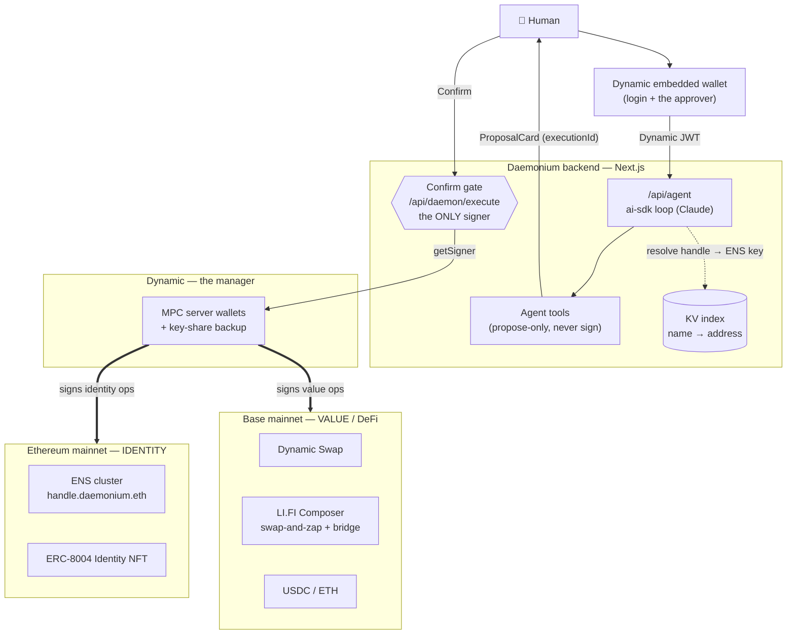
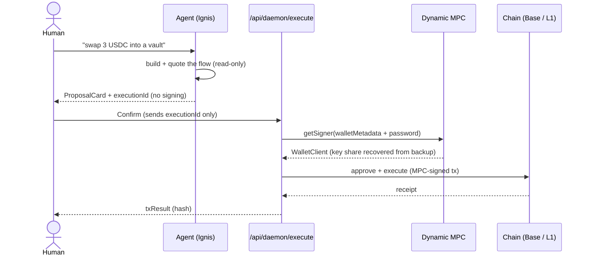
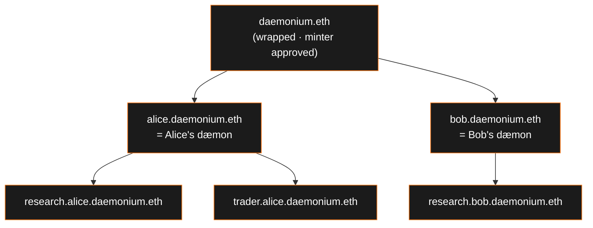
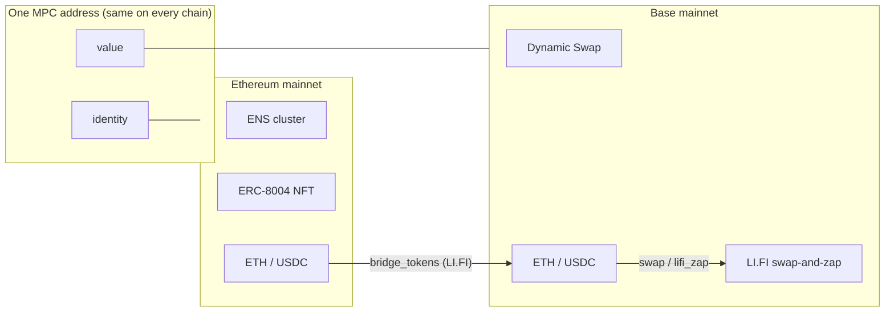
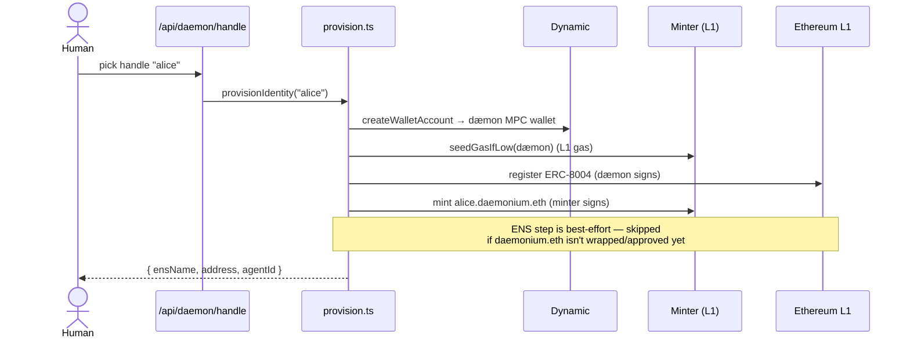
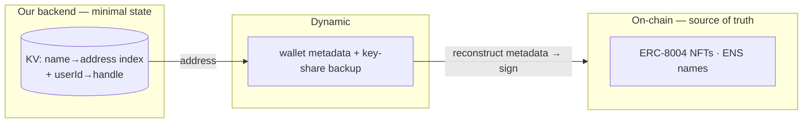

# Daemonium — architecture at a glance

> _The system, in diagrams. Deep-dives: [`dynamic.md`](./dynamic.md) (the wallet),
> [`ens.md`](./ens.md) (the name + cluster), [`lifi.md`](./lifi.md) (DeFi on Base)._

**One idea:** _the agent IS the wallet; Dynamic is the manager._ A user's dæmon (Ignis) owns its own
MPC server wallet and acts onchain by itself — every state-changing action gated by a single human
confirm. It runs across **two mainnets at once**: its **identity** (ENS name + ERC-8004 card) lives on
**Ethereum L1**; its **value** (USDC/ETH, swaps, yield, bridges) lives on **Base**. Three sponsor
integrations, composed: **Dynamic** (server wallets), **ENS** (subname cluster), **LI.FI** (swap-and-zap
+ bridge).

---

## 1. System overview

The dæmon's **one MPC address** is identical on every EVM chain, so a single wallet spans both layers.

---

## 2. The confirm gate (propose → confirm → execute)

The agent can reason and quote freely, but it **physically cannot sign** — its tools only mint a
proposal. Signing happens in exactly one route, after the human taps Confirm.

Hard caps (`USDC_SEND_CAP`, `SWAP_CAP_USD`, `LIFI_CAP_USD`, …) are enforced server-side as defense in
depth on top of the confirm.

---

## 3. The ENS cluster — the namespace IS the org chart

The minter mints each user's `handle.daemonium.eth` (owned by that user's dæmon); each dæmon then mints
its own sub-agents. The subtree _is_ the cluster — org chart and trust boundary in one. Every node owns
its own wallet and ERC-8004 card.

Authority flows downward: you can only mint under a name you own (`onlyTokenOwner`), so the minter (one
approved operator) bootstraps the `handle` level and dæmons own everything below themselves.

---

## 4. Hybrid two chains — and bridging between them

`get_balance` reports **both** chains. If the agent's funds are on L1 but it needs to act on Base, it
bridges with `bridge_tokens` (LI.FI) first, then swaps/zaps on Base.

---

## 5. Provisioning a dæmon (auto, at handle pick)

Each step is **decoupled + idempotent**: a gas hiccup or a missing ENS prereq never loses the wallet or
the identity — re-running provisioning self-heals the rest.

---

## 6. Where state lives (almost nowhere, on our side)

We persist **no key material and no wallet metadata** — only a tiny name→address index (Vercel KV, with a
local-file fallback). Signable `walletMetadata` is reconstructed from Dynamic's `getEvmWallets()` on
demand, and shares are recovered from Dynamic's backup at sign time. So the app deploys with no writable
filesystem and no secrets in our store. See [`dynamic.md`](./dynamic.md#the-most-important-technical-fact-dynamic-is-the-wallet-store-we-persist-almost-nothing).
